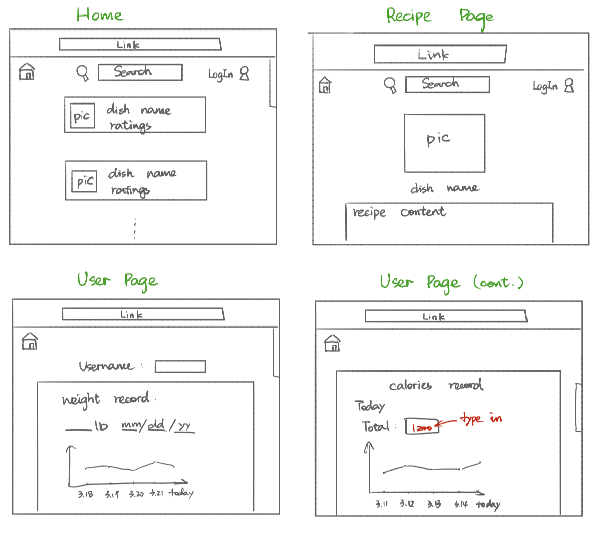

# Healthy Eat
By Tianli Ding (td2)  
Moderator: Haiming Zhang (haiming2)  
This is a mobile app for CS242 final project

## Abstract
### Project Purpose & Motivation
Due to the coronavirus, everybody is asked to stay at home. Therefore, I started to cook for myself everyday at home. However, it is hard to cook for newbies like me without recipe. Hence, I am planning to develop a platform with hundreds of recipes. Besides, many girls, including me, care about their weight, especially in the situation that we can barely go out for walking and working out. I decide to add functionalities helping to record, track weight and/or calculate total calories for each day, so that people who need control weight, like athletes, could use it for documentation.  

## Technical Specification
Platform: React.js 
Programming Languages: JavaScript (Python for Flask should backend required)
Stylistic Conventions: Airbnb JavaScript Style Guide & PEP8 Standard
IDE: Visual Studio Code
Tools/Interfaces: Website, a laptop will be fine
Target Audience: People interested in Chinese food, and need of recording weight

## Functional Specification
### Features:
First, the following information will be scraped from the website mentioned above:
- dish name
- prep time
- cooking time
- total time
- ratings
- ingredient
- cooking methods 
These data will be stored as JSON format in local machine.

Second, the developed website allow users to search for the keyword of the recipe.  

Third, the user information will include:
- username
- password
- weight(self report)
- calories(self report)  
These information will be stored in MongoDB.

### Scope of the project
- Limitations: Since this website only have Chinese food recipes, it may not fit those who do not eat Chinese food. I will consider to include more type of food recipes in the future.

## Sketch

## Weekly BreakDown
### First week (backend)
Category | Total Score Allocated | Detailed Rubrics
-------- | --------------------- | ----------------
Scrape data | 5 | <ul><li>0 points: lack of any form of a web scraper</li><li>2 points: scrapper works but cannot scrape 100+ recipes</li><li>5 points: complete 100+ recipes saved in local machine</li></ul>
Set up MongoDB storing User Information | 5 | <ul><li>0 points: no database set up</li><li>1 points: system setup with a database</li><li>2 points: system can read from the database without errors</li><li>3 points: system can insert information into the database without errors</li><li>4 points: system can delete information from the database without errors</li><li>5 points: system can edit information into the database without errors</li></ul>
unittest | 5 | <ul><li>0 points: no test</li><li>+1 point for every two tests</li></ul>
manual test plan| 5 | <ul><li>0 points: no manual test plan</li><li>1 pts if the test plans include only environment setup OR scenario descriptions</li><li>2 pts for test plans that contained only some content and can be further improved (~8 pages)</li><li>4 pts for test plans that contained most of the content (~10 pages)</li><li>5 pts for well-composed test plans covering all aspects of the system(~12 pages)</li></ul>
store 20 users in database | 3 | <ul><li>0 points: no real users in dababase</li><li>1 points: 5 real users</li><li>2 points: system can read from the database without errors</li><li>3 points: system can write from the database without errors</li></ul>

